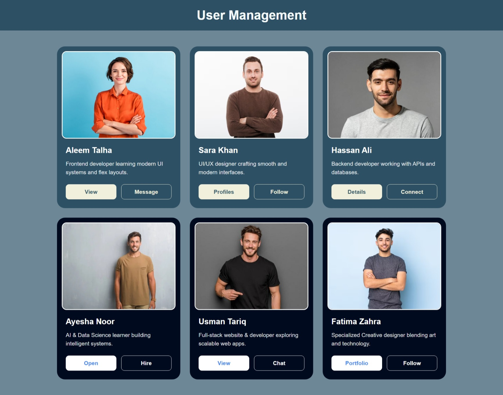
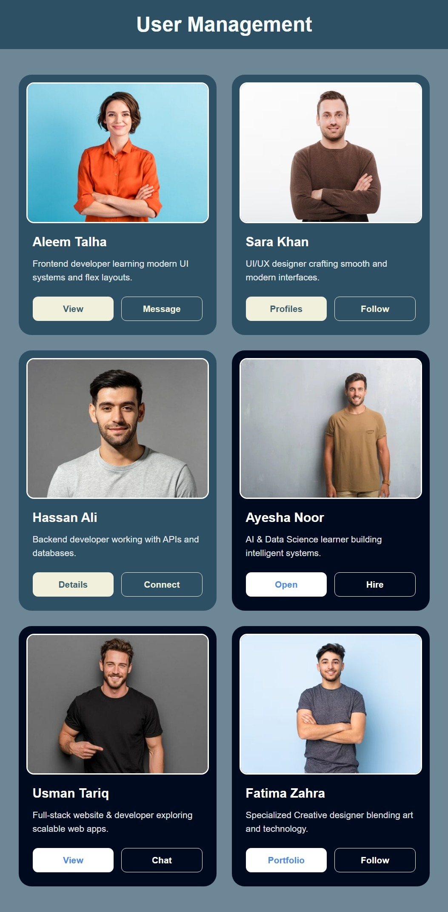
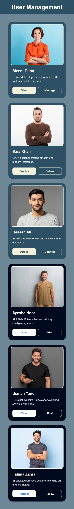

# flexbox-user-management-ui

A Flexbox practice project demonstrating responsive card layouts, alignment, spacing, and wrapping using HTML and CSS.

---

## Project Previews

### Desktop View

### Tablet View

### Mobile View

---

## Description

This assignment helps students understand the concept of CSS Flexbox in HTML and CSS.  
The project demonstrates how items can be arranged in rows and columns while maintaining proper alignment and spacing.

The layout contains multiple user cards with:
- User images
- User details
- Action buttons
- Responsive Flexbox layout

Students can observe how the parent container controls the arrangement and behavior of child elements using Flexbox properties.

---

## Features

- Responsive card layout
- CSS Flexbox implementation
- Flex wrapping
- Alignment and spacing
- Modern UI design
- Responsive images
- Button groups using Flexbox
- Clean and organized structure

---

## Technologies Used

- HTML5
- CSS3
- Flexbox

---

## Flexbox Concepts Practiced

This project focuses on:

- `display: flex`
- `flex-direction`
- `flex-wrap`
- `justify-content`
- `gap`
- `flex-grow`
- `flex`

---
